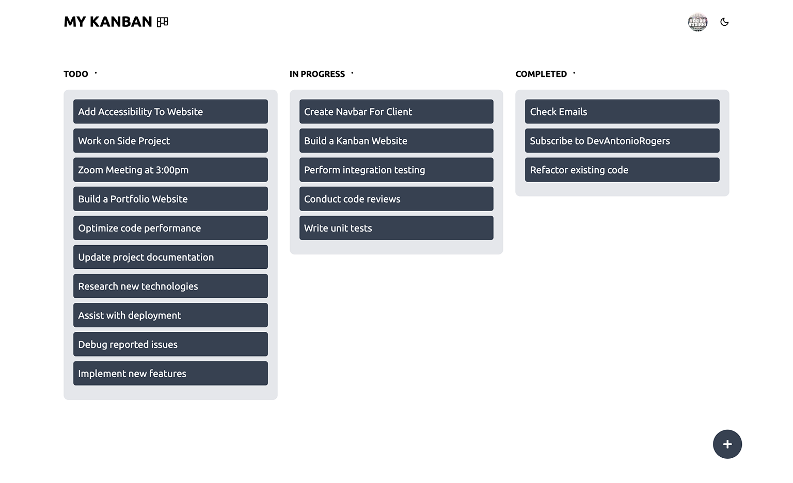

# My Kanban

A modern, responsive Kanban board built with **Next.js**, **TypeScript**, and **Supabase** to help users organize tasks efficiently using a drag-and-drop interface.

## ✨ Features

- 🔐 User Authentication (Sign Up & Sign In)
- 📝 Create, edit, and delete tasks
- 📋 Create a personal Kanban board
- 🎯 Drag and drop tasks between columns
- 🌙 Light & Dark mode
- 📱 Fully responsive design
- ⚡ Server Actions for database operations
- 🔄 Real-time UI updates after task actions
- 🗄️ Supabase PostgreSQL database
- 🔒 Row Level Security (RLS)

---

## 📸 Preview



---

## 🛠️ Tech Stack

### Frontend

- Next.js (App Router)
- React
- TypeScript
- Tailwind CSS
- Framer Motion
- @hello-pangea/dnd
- React Icons
- React Hot Toast

### Backend

- Supabase
- PostgreSQL
- Supabase Authentication
- Server Actions
- API Route handlers

---

## 📂 Project Structure

MY-KANBAN
app/
├── actions/
├── api/
├── auth/
├── components/
│   ├── ui/
│   ├── Column.tsx
│   ├── Hero.tsx
│   ├──KanbanBoard.tsx
│   ├──Navbar.tsx
│   └── ...
├── myKanban/
├── onboarding/
├── globals.css
├── layout.tsx
└── page.tsx

context/
└── ToasterContext.tsx

providers/
└── Theme.tsx

utils/
└── supabase/
    ├── client.td
    ├── middleware.ts
    └── server.ts

types/

public/
├── file.svg
├── globe.svg
├── hero-image.png
└── ...


---

## 🚀 Getting Started

### Clone the repository

```bash
git clone https://github.com/yourusername/my-kanban.git
```

```bash
cd my-kanban
```

### Install dependencies

```bash
npm install
```

### Create a `.env.local`

```env
NEXT_PUBLIC_SUPABASE_URL=your_project_url
NEXT_PUBLIC_SUPABASE_ANON_KEY=your_anon_key
```

### Run the development server

```bash
npm run dev
```

Visit:

```
http://localhost:3000
```

---

## 🗄️ Database

The project uses **Supabase PostgreSQL**.

---

## 🎯 Task Workflow

Tasks move through three stages:

- 📝 Todo
- 🚧 In Progress
- ✅ Completed

Drag-and-drop updates the task status automatically.

---

## 🔐 Authentication

Users authenticate with Supabase Auth.

Each user:

- owns exactly one board
- can only access their own tasks
- cannot access another user's data

---

## 🌙 Theme Support

Supports both Light and Dark mode using **next-themes**.

---

## 📦 Future Improvements

- Task due dates
- Task priorities
- Labels & tags
- Multiple boards
- Board sharing
- Search & filtering
- Activity history
- Real-time collaboration
- File attachments

---

## 🤝 Contributing

Contributions are welcome!

1. Fork the repository.
2. Create a feature branch.
3. Commit your changes.
4. Open a Pull Request.

---

## 📄 License

This project is licensed under the MIT License.
